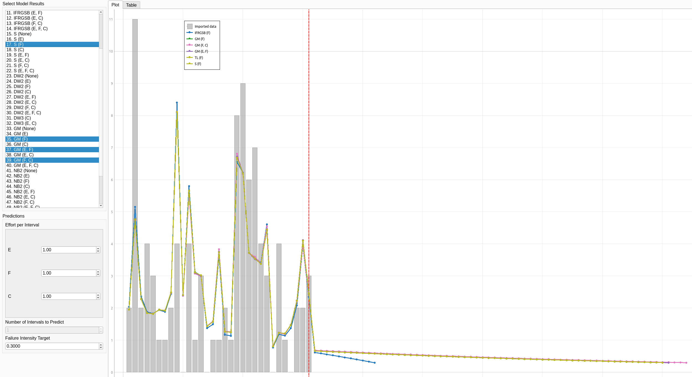

**SENG 637- Dependability and Reliability of Software Systems***

**Lab. Report \#5 – Software Reliability Assessment**

| Group \#:6     |     |
| -------------- | --- |
| Student Names: |     |
| Sean Temple    |     |
| John Chernoff               |     |
| Nicholas Langley               |     |
| Raisa Mehjabin Azni            |   
| Eric Yoon            |   

# Introduction

In this lab report we focus on the dependability and reliability of software systems, specifically through hands-on practice with reliability assessment tools. The aim is to analyze integration test data using two distinct approaches: Reliability Growth Testing and Reliability Demonstration Chart (RDC). By implementing these methodologies, we will evaluate the failure data of a hypothetical system to understand its reliability over time and under testing conditions.

The first part of the lab involves installing and utilizing reliability growth assessment tools such as START or C-SFRAT to generate failure rate and reliability plots from provided test data. This exercise will enhance our understanding of how software reliability evolves as defects are identified and corrected, which is crucial for developing robust software systems.

In the second part, we employ an RDC tool to assess whether the system meets specified reliability targets, which is particularly useful when failure data are scarce. This approach will provide insights into the adequacy of the testing process and whether the system's mean time to failure (MTTF) meets the desired thresholds.

# Assessment Using Reliability Growth Testing 
We used two tools first being C-SFRAT where the dataset was imported directly. The data series discriptions are as follows:

> T: time interval

> FC: failure count

> E: execution time measured in hours

> F:failure identification work measured in person hours

> C: computer time failure identification measured in hours 

After running the models the results of all combinations graphed:

On first glance, almost all of the models generally follow the trend of the data, the only models that don't follow it are the ones using the IFR Salvia & Bollinger (non-generalized) Hazard function

## Result of model comparison (selecting top two models)
To determine the best model in the C-SFRAT software uses a weighted average of Akaike information criterion (AIC) and Bayesian Information Criteria (BIC) as well as sum of squares (SSE) and predictive sum of squares error (PSSE).Keeping default values weights all equally while excluding predictive sum of squares error (PSSE). Sorting the table leaves the best preforming models at the top of the chart below:

Best models overladed with actual data:

With three of the top models the overall best performing model is geometric.

## Result of range analysis (an explanation of which part of data is good for proceeding with the analysis)
The models are applied to a set of failure data, are derived from a series of tests performed on the software system in issue. In overall, the objective of the range analysis is to determine the interval in which the model's predictions closely correspond to the observed data. This range signifies the extent to which the model's assumptions are sound and it can predict future behavior with confidence. According to the depiction of actual data versus predictions (Raw vs ScratchV), it can be concluded that the initial segment of the data exhibits a disparity between anticipated and observed failure incidents. This discrepancy may suggest the presence of an initial "burn-in" phase, during which early-life failures are more prevalent and less predictable. The observed correlation between predicted and actual failures appears to strengthen as the data accumulates, indicating that the model's efficacy appears to have increased beyond this initial stage. In this context, range analysis proves to be highly beneficial: it identifies the post-burn-in period as the most informative for analysis due to the likelihood that it eliminates early anomalies or non-representative failure rates that may introduce bias into the accuracy of the model.

The section of data beyond the first discrepancies—where the model's predictions and the actual data converge—would be judged 'excellent' or appropriate. This section depicts a more stable stage of the system, in which the failure process becomes more predictable and the reliability growth models can give useful insights into the system's behavior under test settings. The range analysis in this context aids in identifying the segment of data that provides a more accurate portrayal of the system's reliability patterns, while removing early-test data that may show an aberrant failure pattern that is not reflective of the system's regular operating condition. This concentrated analysis enables more confident decision-making about the software's fitness for deployment and the need for more testing and development.

## Plots for failure rate and reliability of the SUT for the test data provided

## A discussion on decision making given a target failure rate
Setting a failure intensity target of 0.3 the models all predict a lot more intervals are required failures are within range:

Given more data on the project a prediction of costs can be made using the last tab of the C-SFRAT software. These predictions are based on the effort per interval across the different covariates. Playing around with these effort values allows the user to see how different allocations of resources can affect the predicted failure rate. If one setup has a significant advantage over the other, the distibution of effort can be adjusted to match, potentially improving speed of improvement.  

For the example data provided, the IFR Salvia & Bollinger (non-generalized) hazard function predicts the failure rate will be reached in 11  more intervals, but the other top scoring functions  predict much longer times. The longer times should probably be taken more seriously due to the increased number of fucntions predicting that range, as well as to avoid being too optimistic when making decisions.

## A discussion on the advantages and disadvantages of reliability growth analysis

Reliability Growth Analysis (RGA) is a vital method used in assessing system reliability, offering several advantages and some notable disadvantages. One significant advantage of RGA is its ability to track the reliability of a system over time, providing insights into how modifications and improvements affect the system's performance. This iterative approach allows engineers to identify failure modes and implement corrective actions, thus enhancing system reliability incrementally. Moreover, RGA helps in planning maintenance and predicting future failures, which can be crucial for budgeting and logistics in industries where uptime is critical.

However, the method also has its drawbacks. RGA requires detailed data collection and rigorous testing, which can be resource-intensive and costly. The accuracy of the analysis highly depends on the quality and comprehensiveness of the failure data collected, making it less effective in scenarios where data is sparse or incomplete. Additionally, the method assumes that improvements will continue to enhance reliability, which may not always hold true in complex systems where interactions between components can introduce new, unforeseen failure modes. Lastly, RGA can be less applicable to brand-new systems where historical data is not available, potentially limiting its effectiveness in early development stages.

In summary, while Reliability Growth Analysis is a powerful tool for enhancing and assessing system reliability, its effectiveness is contingent upon the availability of detailed failure data and can be limited by the costs and applicability in certain scenarios. This necessitates a balanced approach, integrating RGA with other reliability assessment techniques to achieve a comprehensive evaluation.

# Assessment Using Reliability Demonstration Chart 

## 3 plots for MTTFmin, twice and half of it for your test data

## Explain your evaluation and justification of how you decide the MTTFmin
The calculation of the minimum Mean Time To Failure (MTTFmin) is a critical component in assessing reliability and appears to be supported by both empirical and theoretical reasoning. The MTTFmin serves as the critical value at which the reliability of a system is considered inadequate to fulfill its designated function. Achieving this threshold needs a meticulous equilibrium among regulatory requirements, practical viability as evidenced by empirical test data, and customer expectations. The Reliability Demonstration graph, show an intersection point where the 'Accept' and 'Reject' regions part ways. There appears to be an effect of the normalized measure (MTTFs) against the failure number on the positioning of this threshold. It seems that a significant threshold has been established for the MTTFmin—a level at which the reliability of the system reaches or surpasses the minimum confidence level necessary for adoption.

The selection of MTTFmin is based on the balance between customer risk and developer risk, as shown by the parameters in the RDC tool. The selection of a conservative minimum mean time to failure (MTTFmin) is clearly deliberate, most likely to achieve a high degree of trust in the system's dependability, while also taking into account the associated costs and practical considerations of meeting this requirement. The 'Failure Data' locations, shown by the blue triangles, act as empirical reference points that direct the positioning of MTTFmin, guaranteeing that the decision is based on data rather than being arbitrary. The logic behind the selection of MTTFmin places significant importance on robustness, as it involves selecting a number that indicates a conservative approach while being supported by the actual performance of the system observed during testing. This guarantees that the MTTFmin is not only a theoretical concept, but also a feasible and verifiable reliability target, hence matching the system's performance with reliability goals and stakeholder expectations.

## A discussion on the advantages and disadvantages of RDC

Reliability demonstration charts (RDCs) serve as useful tools in quality and reliability engineering, providing a visual representation of reliability data that aids in communicating the reliability status of systems or components. One of the key advantages of using an RDC is its ability to support decision-making processes by illustrating the confidence levels and reliability estimates across different sample sizes. This visual aid can be particularly beneficial when determining the amount of testing required to meet specific reliability targets. Additionally, RDCs enable a quantitative analysis of reliability, calculating the probability that a system will reach a certain level of reliability over a specified duration. This is crucial in industries where high reliability is paramount, such as in aerospace or medical devices. The flexibility of RDCs to adapt to various testing scenarios and their ability to help manage resources efficiently by optimizing test planning are also significant benefits.

However, there are several disadvantages associated with RDCs. Their effectiveness heavily relies on the assumptions made about the statistical distribution of failure times. Incorrect assumptions can lead to unreliable estimates, compromising the tool's effectiveness. The accuracy of RDCs is also dependent on sample size, with small samples possibly leading to low confidence levels and inaccurate reliability estimates. The requirement for a certain level of statistical knowledge for correct interpretation introduces another layer of complexity, which could result in misinterpretations and poor decision-making if the team lacks the necessary expertise. Furthermore, RDCs focus predominantly on failure data to estimate reliability, necessitating sufficient failure occurrences to form reliable conclusions, which can be both challenging and costly in systems where failures are rare. Lastly, the conservative nature of RDCs might lead to over-testing or over-engineering, thereby inflating costs unnecessarily.

Overall, while RDCs offer structured and visually engaging ways to demonstrate system reliability, their use should be balanced with careful statistical analysis and complemented by other analytical methods to ensure comprehensive system evaluations and informed decision-making.

# Comparison of Results
Through comparing the convergence or divergence of these model lines with the step-function-like graph that represents actual failure data, the accuracy of predictions can be starkly contrasted. Different predictive behaviors are exhibited by the reliability growth models, including geometric and Littlewood. Some of these, the geometric model appears to provide a more accurate approximation to the actual data, particularly in the later intervals, as indicated by the line of prediction that aligns with the failure data steps.

The graphical overlays in the "Best models overlaid with actual data" graph not only show which models are closely tracking the failure data, but also detect periods of over- or under-estimation of failures. In addition, the accuracy of each model's predictions may also be determined by examining the location of model lines around the actual failure phases. The closer the lines are to each other, the greater the agreement among the models on the system's reliability at that specific moment.

The ultimate comparison indicates that some models excel at predicting early failures, while others show greater accuracy across the whole lifespan of the system. Hence, the choice of the most suitable model may vary depending on the particular stage of system operation under consideration, such as the initial phase, intermediate phase, or deterioration phase. This thorough comparison of several reliability growth models highlights the subtle differences in model selection and stresses the significance of taking numerous viewpoints into account when evaluating the dependability of intricate systems. The comparison findings not only provide information about which model is the most suitable for the present data, but also give strategic insights for continuing reliability improvement and focused testing.

# Discussion on Similarity and Differences of the Two Techniques

Reliability growth analysis is primarily used during the development phases of a product to monitor and improve its reliability over time. It involves collecting failure data from testing phases and using statistical models to predict future reliability performance. This method helps engineers identify trends in reliability improvement, assess the effectiveness of modifications, and forecast the reliability of a system at the time of its release. It is dynamic, allowing for ongoing updates as more data becomes available, thus providing a detailed view of reliability evolution over time.

In contrast, a reliability demonstration chart is a tool used to verify that a system meets predefined reliability requirements at a specific point in time, typically at the end of a development phase or before the product launch. This method involves conducting tests under defined conditions to statistically prove that the system's reliability reaches the required thresholds. It is a more static approach that focuses on achieving and demonstrating compliance with reliability targets rather than observing reliability changes over time.

Both methods are crucial for ensuring system reliability, but their application differs significantly. Reliability growth analysis offers a more comprehensive and ongoing assessment that can guide development processes, while reliability demonstration charts are used to provide confidence that the system meets specific, critical reliability standards before going to market. In practice, combining both approaches provides a robust strategy for developing and validating the reliability of complex systems, leveraging the continuous improvement aspect of reliability growth analysis along with the conclusive testing of reliability demonstration charts.

# How the team work/effort was divided and managed

Each team member ran the software and performed the analyses on their own, then the whole team came together to discuss the results and create the report.

# Difficulties encountered, challenges overcome, and lessons learned

Some of the softwares can be difficult to use and interpet. Each of the team members initially struggled understanding how the dataset needed to be modified to work with the programs. Another difficulty ecountered by the team was understanding the failure dataset, which was hard to decipher without reading the accompanying study. 

# Comments/feedback on the lab itself

It might make the lab easier to interpet if the data is provided in the txt format used by most of the programs rather than just the excel format. Overall this was an interesting and informative lab that helped introduce the team to reliability testing. 

